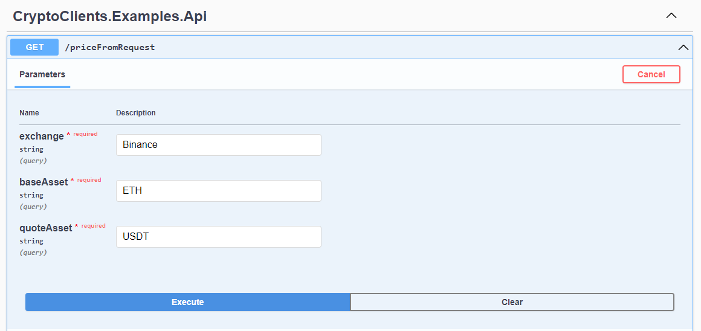
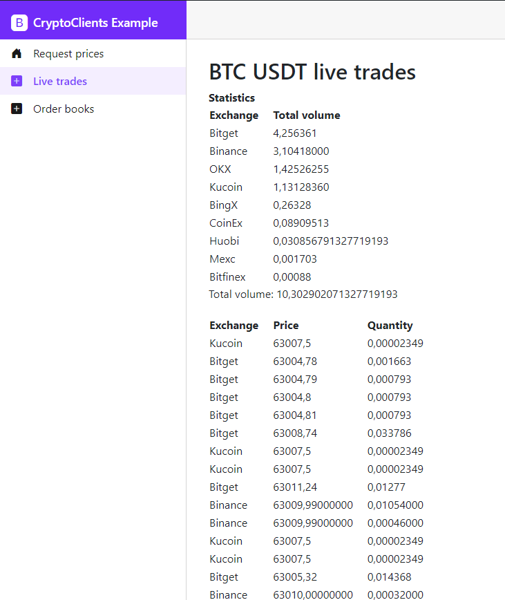
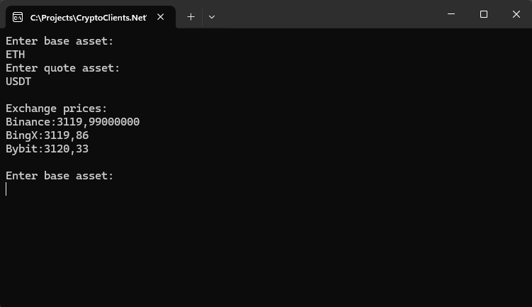
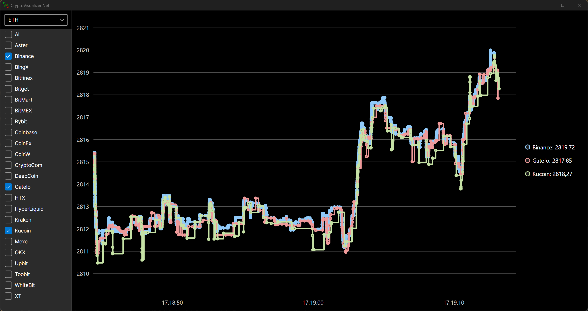

## CryptoClients.Net examples

### CryptoClients.Examples.Api
An example of how to use CryptoClients.Net in a web API

### CryptoClients.Examples.Blazor
An example of how to use CryptoClients.Net in a Blazor server application

### CryptoClients.Examples.Console
A basic console application showcasing how CryptoClients.Net can be used

### CryptoVisualizer.Net
Chart visualization of live trades on all exchanges using Avalonia  
(Set CryptoVisualizer.Net.Desktop as startup project)
